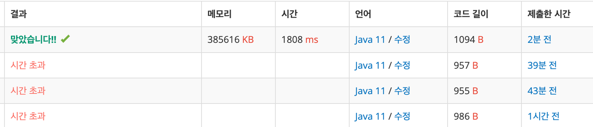
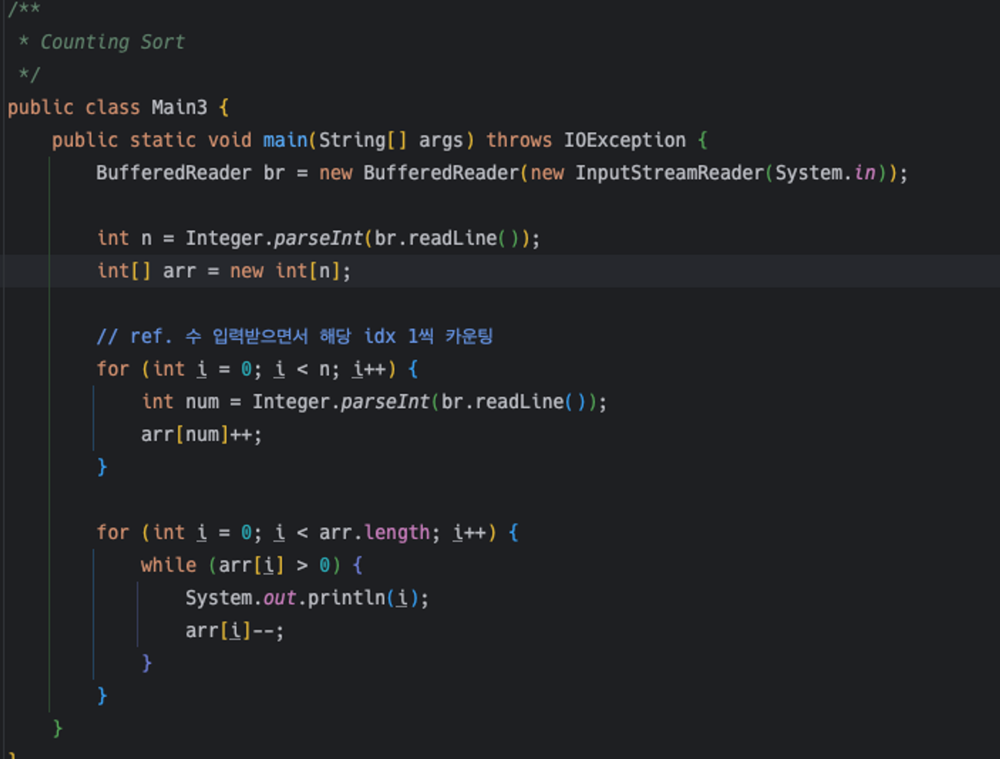

# Second Blog

### 👾 chap.01 알고리즘 스터디 Type up

스터디 Type up.

오늘까지 풀어야 하는데 프로젝트 때문에 정신없어서 정렬 풀다가 다시 푸니까.. 약간.. 희미하다.. Java/Spring 공부하면 알고리즘/코테가 희미해지고, 알고리즘/코테 공부하면 Java/Spring이 희미해짐.

### adj.

이번 주 풀어야할 문제는: **정렬, 탐색(DFS, BFS), Binary Search**

---

2024년 1월 23일 

# ◎ **수 정렬하기 3**

| 시간 제한 | 메모리 제한 | 제출 | 정답 | 맞힌 사람 | 정답 비율 |
| --- | --- | --- | --- | --- | --- |
| 5 초 (https://www.acmicpc.net/problem/10989#) | 8 MB (https://www.acmicpc.net/problem/10989#) | 275612 | 65128 | 49767 | 23.716% |

## 문제

N개의 수가 주어졌을 때, 이를 오름차순으로 정렬하는 프로그램을 작성하시오.

## 입력

첫째 줄에 수의 개수 N(1 ≤ N ≤ 10,000,000)이 주어진다. 둘째 줄부터 N개의 줄에는 수가 주어진다. 이 수는 10,000보다 작거나 같은 자연수이다.

## 출력

첫째 줄부터 N개의 줄에 오름차순으로 정렬한 결과를 한 줄에 하나씩 출력한다.

## 예제 입력 1

```
10
5
2
3
1
4
2
3
5
1
7
```

## 예제 출력 1

```
1
1
2
2
3
3
4
5
5
7
```

# 1차 시도

```jsx
public class Main {
    public static void main(String[] args) throws IOException {
        BufferedReader br = new BufferedReader(new InputStreamReader(System.in));

        int n = Integer.parseInt(br.readLine());
        int[] arr = new int[n];

        for (int i = 0; i < arr.length; i++) {
            arr[i] = Integer.parseInt(br.readLine());
        }
        Arrays.sort(arr);
        for (int ele : arr) {
            System.out.println(ele);
        }
    }
}
```

시간초과다. 모든 값을 배열에 저장한 후, 배열 전체를 정렬했다. 이 경우 시간 복잡도는 O(n log n)이다. 수3 의 개수가 (1 ≤ N ≤ 10,000,000) 이므로 시간 초과가 발생할 수 있다.

```jsx
import java.io.BufferedReader;
import java.io.IOException;
import java.io.InputStreamReader;
import java.util.Arrays;

public class Main {
    public static void main(String[] args) throws IOException {
        BufferedReader br = new BufferedReader(new InputStreamReader(System.in));

        int n = Integer.parseInt(br.readLine());
        int[] arr = new int[n];

        for (int i = 0; i < arr.length; i++) {
            arr[i] = Integer.parseInt(br.readLine());
        }
        Arrays.sort(arr);

        StringBuilder sb = new StringBuilder();

        for (int ele : arr) {
            sb.append(ele).append('\n');
        }
        System.out.println(sb);
    }
}
```

동일 풀이법을 이렇게 정리해서 다시 간신히 성공은했다.

# 놓친 것

### 출력 방법

`System.out.println`을 사용하여 출력했다. 매 출력마다 내부적으로 I/O 버퍼를 비우는 작업을 수행해야 하므로 상당히 느리다. 따라서 `StringBuilder`를 사용해 문자열을 만든 후, 한 번에 출력하는 것이 시간을 단축할 수 있는 방법이다.

```jsx
for(int num : arr) {
			sb.append(num).append('\n');
		}
```

# **어떻게 풀어나갈 것인가?**

- 최소값 변수를 생성한 후, 최소값보다 작다면 배열에 입력 아니면?
- 출력 시 개행하여 한 번에 출력하기
- 정렬 알고리즘 사용하기 : 카운팅 정렬 → 이건 백준에서 힌트를 찾아봤다.

# 2차 시도

### 계수정렬 - 시간초과

```jsx
import java.io.BufferedReader;
import java.io.IOException;
import java.io.InputStreamReader;
import java.nio.Buffer;

/**
 * sec. Counting Sort로 풀기
 */

public class Main2 {
    public static void main(String[] args) throws IOException {
        BufferedReader br = new BufferedReader(new InputStreamReader(System.in));

        int n = Integer.parseInt(br.readLine());
        int[] arr = new int[n];

        for (int i = 0; i < arr.length; i++) {
            arr[i] = Integer.parseInt(br.readLine());
        }
        // ref. cnt 배열에 arr배열의 값을 idx로 하는 cnt idx 배열의 값을 1++;
        int[] cnt = new int[n];
        for (int i = 0; i < cnt.length; i++) {
            cnt[arr[i]]++;
        }

        for (int i = 0; i < n; i++) {

            if (cnt[i] != 0) {
                int j = 0;
                while (j < cnt[i]) {
                    System.out.printf(i + " ");
                    j++;
                }
            }
        }
    }
}
```

### 시간초과 원인

1. `BufferedReader`를 사용하여 한 줄씩 읽어들이는 방식
2. `System.out.printf`를 사용하여 각 수를 출력하는 부분

# 3차 시도 시간초과

```jsx
import java.io.BufferedReader;
import java.io.IOException;
import java.io.InputStreamReader;
import java.nio.Buffer;
import java.util.Arrays;

/**
 * sec. Counting Sort로 풀기
 */

public class Main2 {
    public static void main(String[] args) throws IOException {
        BufferedReader br = new BufferedReader(new InputStreamReader(System.in));

        int n = Integer.parseInt(br.readLine());
        int[] arr = new int[100001];
        int[] cnt = new int[arr.length];

        //배열에 값 저장 동시에 cnt 카운팅
        for (int i = 0; i < n; i++) {
            int num = Integer.parseInt(br.readLine());
            cnt[num]++;
        }
        //N.B. : cnt 순회하면서 인덱스 값 출력
        for (int i = 0; i < cnt.length; i++) {

            if (cnt[i] != 0) {
                while (cnt[i] > 0) {
                    System.out.println(i);
                    cnt[i]--;
                }
            }
        }
    }
}
```

필연적으로 최적화가 필요하다.

1. 문제에서 최대값은 10000이라고 했기 때문에 cnt 배열의 개수를 10001으로 정해 놓는다.
2. 그리고 배열을 cnt 하나만 사용해도 될 것이다.

# 4차 시도: 성공

```jsx
public class Main {
    public static void main(String[] args) throws IOException {
        BufferedReader br = new BufferedReader(new InputStreamReader(System.in));
        BufferedWriter bw = new BufferedWriter(new OutputStreamWriter(System.out));
        int n = Integer.parseInt(br.readLine());
        int[] cnt = new int[100001];

        // cnt 배열에 값 저장 동시에 cnt 카운팅
        // b/c 배열의 인덱스를 사용할 것이므로
        for (int i = 0; i < n; i++) {
            int num = Integer.parseInt(br.readLine());
            cnt[num]++;
        }
        StringBuilder sb = new StringBuilder();
        // N.B.: cnt 순회하면서 cnt idx의 원소가 0이 될 때까지 출력
        for (int i = 0; i < cnt.length; i++) {
            while (cnt[i] > 0) {
                sb.append(i + "\n");
                cnt[i]--;
            }
        }
        bw.write(sb.toString());
        bw.flush();
        bw.close();
        br.close();
    }
}
```


### 왜 성공

1. `BufferedReader`와 `BufferedWriter`를 사용해서 입/출력 처리.
    1. 내부적인 버퍼를 이용해서 데이터를 읽고 쓰므로, 대량 데이터 처리 시 **시간 절약할 수 있음.**
2. `StringBuilder`를 사용해서 모든 출력을 한 번에 처리.
    1. `System.out.println`과 같은 메소드를 사용해서 한 번에 한 줄씩 출력하는 것보다 더 효율적이다.
3. **카운팅 정렬 알고리즘**
    1. 데이터 크기 범위가 제한적일 때 효율적, 시간 복잡도 O(n)이다. 이 문제의 경우 입력되는 수의 범위가 **1부터 10,000이므로** 카운팅 정렬을 사용할 수 있다. 문제가 너무 안 풀려서 백준 사이트 가이드라인을 봤는데, 힌트가 ‘수의 범위가 제한되어 있다’ 였다.

### 이 문제에서 왜 카운팅 정렬 알고리즘이 효율적인지

일반적인 정렬 알고리즘(예: 퀵소트, 병합정렬 등)의 경우, 시간 복잡도는 O(n log n)이다. 데이터 개수가 많아질 수록 정렬하는 데 시간이 더 소요된다. 

반면 카운팅 정렬의 경우 시간 복잡도가 O(n)으로, 데이터 개수랑 직접적으로 비례한다. → 따라서, 수의 범위가 제한적이고 그 범위 내에 많은 데이터가 있을 경우엔 카운팅 정렬이 더 효율적이다.

단, 수의 범위가 넓어질수록 카운팅 정렬을 위한 배열 크기도 커져야 하므로, 이 경우에는 다른 정렬 알고리즘을 사용하는 것이 더 효율적일 수 있다는 점.

### 📌 ref. 일반적 알고리즘 시간 복잡도

| 시간 복잡도 | 설명 | 예시 |
| --- | --- | --- |
| O(1) | 입력 데이터의 크기와 상관없이 알고리즘은 항상 일정한 시간이 걸린다. | 배열의 특정 요소에 접근하기 |
| O(n) | 알고리즘의 수행 시간은 입력 데이터의 크기에 직접적으로 비례한다. | 배열의 모든 요소를 확인하거나 출력하기 |
| O(log n) | 알고리즘의 수행 시간은 입력 데이터의 크기 로그에 비례한다. | 이진 검색 알고리즘 |
| O(n log n) | 알고리즘의 수행 시간은 입력 데이터의 크기와 그 데이터의 로그의 곱에 비례한다. | 퀵 소트나 병합 소트 같은 고급 정렬 알고리즘 |
| O(n^2) | 알고리즘의 수행 시간은 입력 데이터의 크기의 제곱에 비례한다. | 버블 소트나 삽입 소트 같은 간단한 정렬 알고리즘 |
| O(2^n) | 알고리즘의 수행 시간은 입력 데이터 크기의 지수 함수에 비례한다. | 부분 집합 합 문제, 여행자의 문제(TSP) |

### 다시 풀기: 시간초과

..? ⇒ ✨ **배열 생성할 필요없다고 그냥 입력받으면서 임시배열 카운트를 증가시키라고.**

```jsx
import java.io.*;

/**
 * Counting Sort
 */
public class Main3 {
    public static void main(String[] args) throws IOException {
        BufferedReader br = new BufferedReader(new InputStreamReader(System.in));

        int n = Integer.parseInt(br.readLine());
        int[] arr = new int[n];

        for (int i = 0; i < n; i++) {
            arr[i] = Integer.parseInt(br.readLine());
        }
        // ref. 배열에 있는 수에 해당하는 idx의 count를 증가시키고 그 수만큼 출력
        // idx에 해당하는 idx를 1씩 증가
        int[] temp = new int[n];

        for (int i = 0; i < arr.length; i++) {
            temp[arr[i]]++;
        }
        for (int i = 0; i < temp.length; i++) {
            while (temp[i] > 0) {
                System.out.println(i);
                temp[i]--;
            }
        }
    }
}
```
### 또 시간초과



---

# ◎ 가장 큰 수

### **문제 설명**

0 또는 양의 정수가 주어졌을 때, 정수를 이어 붙여 만들 수 있는 가장 큰 수를 알아내 주세요.

예를 들어, 주어진 정수가 [6, 10, 2]라면 [6102, 6210, 1062, 1026, 2610, 2106]를 만들 수 있고, 이중 가장 큰 수는 6210입니다.

0 또는 양의 정수가 담긴 배열 numbers가 매개변수로 주어질 때, 순서를 재배치하여 만들 수 있는 가장 큰 수를 문자열로 바꾸어 return 하도록 solution 함수를 작성해주세요.

### 제한 사항

- numbers의 길이는 1 이상 100,000 이하입니다.
- numbers의 원소는 0 이상 1,000 이하입니다.
- 정답이 너무 클 수 있으니 문자열로 바꾸어 return 합니다.

### 입출력 예

| numbers | return |
| --- | --- |
| [6, 10, 2] | "6210" |
| [3, 30, 34, 5, 9] | "9534330" |

---

### 생각 정리

```jsx
1. 정수를 이어붙여 만들 수 있는 가장 큰 수라면, 원소의 첫 번째 숫자(1000)가 큰 것이 무조건 큼
2. 다만 각 원소가 0 - 1000까지 이므로 앞자리 수를 기준으로 입력할 수 없음
3. 단순히 숫자 크기를 비교하는 게 아니라 숫자를 이어붙였을 때를 생각해야 함
```

---

### 👥 팀원 풀이

- 정수 배열을 String으로 변환해서, `Array.compareTo` 메소드를 사용했다.
    - `compareTo` 메소드는 두 개의 객체를 비교하는 데 사용되는 Java 메소드이다.
    - 비교 대상 객체가 주어진 객체보다 작으면 음수를, 같으면 0을, 크면 양수를 반환한다.

---

2024년 1월 27일 

# **DFS와 BFS**

| 시간 제한 | 메모리 제한 | 제출 | 정답 | 맞힌 사람 | 정답 비율 |
| --- | --- | --- | --- | --- | --- |
| 2 초 | 128 MB | 268678 | 103846 | 61797 | 37.416% |

## 문제

그래프를 DFS로 탐색한 결과와 BFS로 탐색한 결과를 출력하는 프로그램을 작성하시오. 단, 방문할 수 있는 **정점이 여러 개인 경우에는 정점 번호가 작은 것을 먼저 방문**하고, **더 이상 방문할 수 있는 점이 없는 경우 종료**한다. 정점 번호는 1번부터 N번까지이다.

## 입력

첫째 줄에 **정점의 개수 N(1 ≤ N ≤ 1,000),** **간선의 개수 M(1 ≤ M ≤ 10,000),** 탐색을 시작할 **정점의 번호 V**가 주어진다. 다음 **M개의 줄에는 간선이 연결하는 두 정점의 번호**가 주어진다. 어떤 두 **정점 사이에 여러 개의 간선**이 있을 수 있다. **입력으로 주어지는 간선은 양방향**이다.

## 출력

첫째 줄에 DFS를 수행한 결과를, 그 다음 줄에는 BFS를 수행한 결과를 출력한다. V부터 방문된 점을 순서대로 출력하면 된다.

## 예제 입력 1

```
4 5 1
1 2
1 3
1 4
2 4
3 4령

```

## 예제 출력 1

```
1 2 4 3
1 2 3 4

```

## 예제 입력 2

```
5 5 3
5 4
5 2
1 2
3 4
3 1

```

## 예제 출력 2

```
3 1 2 5 4
3 1 4 2 5

```

## 예제 입력 3

```
1000 1 1000
999 1000

```

## 예제 출력 3

```
1000 999
1000 999
```

---