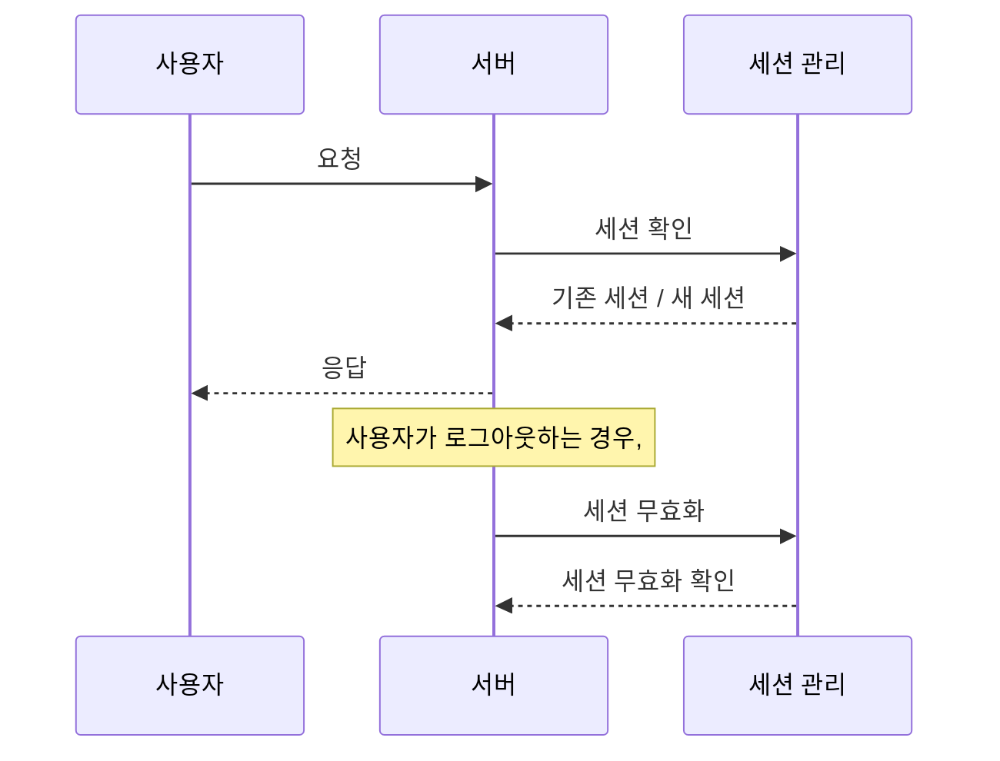

<!-- TOC -->

* [☻ Spring Security 로그인 및 회원가입, 세션 관리](#-spring-security-로그인-및-회원가입-세션-관리)
    * [☺︎ 목표 구현 기능](#-목표-구현-기능)
* [☺︎ Spring SecurityConfig 파일 작성하기](#-spring-securityconfig-파일-작성하기)
* [☻ Spring Security 활용 회원가입](#-spring-security-활용-회원가입)
* [☻ Security 로그인 및 로그아웃](#-security-로그인-및-로그아웃)
* [📌 발생했던 에러 정리](#발생했던-에러-정리)

<!-- TOC -->

---

# ☻ Spring Security 로그인 및 회원가입, 세션 관리

<br>

#### 회원가입


<br>

#### 로그인


<br>

### ☺︎ 목표 구현 기능


> Security를 사용해야하나 말아야 하나 고민했다. ~~(배보다 배꼽이 클까봐..?)~~
 

---

# ☺︎ Spring SecurityConfig 파일 작성하기

Security를 사용하기 위해선 먼저 SecurityConfiguration 작성법을 알아야 하는 것 같다. 과거의 경험으로, 용도를 제대로 구분하지 못하고 복사 붙여넣기로 작성한다면, 웹 접근이 불가능하기
때문이다..

```java
    /**
 * @param http
 * @Feature: Custom Filter chain
 */

@Bean
public SecurityFilterChain securityFilterChain(HttpSecurity http) throws Exception {
    http
            .authorizeHttpRequests(authrizerequests -> authrizerequests
                    .requestMatchers("/user/register", "/user/registerpro", "/user/login", "/user/loginpro", "/main").permitAll()
                    .anyRequest().authenticated())
            .httpBasic(Customizer.withDefaults())
            .formLogin((form) -> form
                    .loginPage("/user/login")//로그인 페이지가 있고, permitAll로 모두 접근 가능
                    .defaultSuccessUrl("/main", true)
                    .failureUrl("/user/loginpro/error")
                    .usernameParameter("email")
                    .passwordParameter("password")
                    .loginProcessingUrl("/user/loginpro")
                    .permitAll()
            )
            .logout((logout) -> logout.logoutSuccessUrl("/user/login")
                    .invalidateHttpSession(true).deleteCookies("JESSIONID"))
            .csrf(AbstractHttpConfigurer::disable)
            .cors(AbstractHttpConfigurer::disable)

            .sessionManagement(httpSecuritySessionManagementConfigurer ->
                    httpSecuritySessionManagementConfigurer
                            .sessionFixation().migrateSession()
                            .sessionCreationPolicy(SessionCreationPolicy.IF_REQUIRED)
                            .maximumSessions(1))

            .oauth2Login(oauth2 ->
                    oauth2
                            .loginPage("/user/login")
                            .defaultSuccessUrl("/main")
                            .userInfoEndpoint(userInfo -> userInfo
                                    .userService(this.principalOauth2UserService)));

    return http.build();
}

```

## ☺︎ Spring SecurityConfig 용도 대분류

| 특징 및 주제               | 설명                                                                                                                                                                                                                                           |
|-----------------------|----------------------------------------------------------------------------------------------------------------------------------------------------------------------------------------------------------------------------------------------|
| securityFilterChain   | 사용자 정의된 필터 체인을 설정하는 부분                                                                                                                                                                                                                       |
| authorizeHttpRequests | 특정 HTTP 요청에 대한 접근 권한을 설정한다. 여기서는 /user/register, /user/registerpro, /user/login, /user/loginpro, /main 등의 경로에 대한 접근을 모든 사용자에게 허용하고 있으며, 그 외의 요청에 대해서는 인증된 사용자만 접근 가능하도록 설정했다.                                                                |
| httpBasic             | HTTP 기본 인증 설정을 추가한다.                                                                                                                                                                                                                         |
| formLogin             | 폼 기반 로그인을 사용하도록 설정한다. 로그인 페이지(.loginPage("/user/login")), 로그인 성공 시 리다이렉트될 페이지는 메인 페이지로 (.defaultSuccessUrl("/main", true)), 로그인 실패 시 리다이렉트될 페이지,(.failureUrl("/user/loginpro/error")). 그리고 사용자 식별자와 비밀번호를 나타내는 파라미터명은 email, password로 설정했다. |
| logout                | 로그아웃 성공 시 /user/login으로 리다이렉션 된다. 그리고 세션을 무효화하고, JESSIONID 쿠키를 삭제한다.                                                                                                                                                                         |
| csrf                  | CSRF(Cross-Site Request Forgery) 보호를 비활성화 한다.                                                                                                                                                                                                |
| cors                  | CORS(Cross-Origin Resource Sharing) 설정을 비활성화한다.                                                                                                                                                                                              |
| sessionManagement     | 세션 관리 관련 설정을 한다. 세션 생성 정책(.sessionCreationPolicy(SessionCreationPolicy.IF_REQUIRED)), 최대 세션 수(.maximumSessions(1)) 등을 설정했다.                                                                                                                  |

### 주의해야 했던 것

formLogin의 `usernameParameter`는 기본적으로 name을 사용하도록 되어있는데, 나는 로그인 시 email을 사용하여 로그인을 진행했으므로 처음에 에러가 발생했다.

이후 공식 문서를 계속 찾아보고 이걸 알게돼서 usernameParameter를 email로 설정해주었다. name이 아닌 다른 속성으로 로그인을 처리한다면 발생할 것이니 꼭 바꿔주어야 한다.

---

# ☻ Spring Security 활용 회원가입

## 구현 로직


---

### ☺︎ 회원가입 처리를 위한 Controller


```jsx
@PostMapping("/user/registerpro")
public String register(@ModelAttribute("registrationRequest") RegistrationRequest registrationRequest, Model model) {
  logger.info("Processing register");
  logger.info("User name={}, email={} ", registrationRequest.getUsername(), registrationRequest.getEmail());
  model.addAttribute("registrationRequest", registrationRequest);
  userService.register(registrationRequest);
  return "redirect:/main";
}
```

사용자의 회원가입 요청을 처리하는 컨트롤러이다. `register` 메소드는 POST 요청을 통해 회원가입 요청을 받아 처리하고, `RegistrationRequest`(Dto)를 인자로 받는다.

이후 `userService`의 `register` 메소드를 호출하여 회원가입 요청을 처리하고, 회원가입이 완료되면 메인 페이지로 리다이렉트한다.

### UserServiceImpl와 비밀번호 암호화


```jsx
@Override
public void register(RegistrationRequest registrationRequest) {
  User user = new User();
  long checkUser = userRepository.countByEmail(registrationRequest.getEmail());
  if (checkUser == 0)
    BeanUtils.copyProperties(registrationRequest, user);
  user.setPassword(bCryptPasswordEncoder.encode(registrationRequest.getPassword()));
  userRepository.save(user);
}
```

서비스 계층에서 실제로 회원가입 요청을 처리한다. 새로운 User 객체를 생성하고, 사용자의 이메일이 이미 데이터 베이스에 존재하는지 검색한다.

만약 신규 사용자로 가입이 가능하면 `BeanUtils.copyProperties`을 사용해 회원가입 요청 정보를 User 객체에 복사한다.

그 다음, `BCryptPasswordEncoder`를 사용하여 사용자가 입력한 비밀번호를 암호화한다.

## **☺︎ 비밀번호 암호화: BCryptPasswordEncoder**

이 부분은 비밀번호를 암호화 해야한다고 생각해서 암호화 라이브러리를 사용했다. 간단히 암호화만 구현했기에 비밀번호 암호화, 암호화 알고리즘, 단방향/양방향에 대해 더 공부가 필요하다고 느꼈다..

우선, 간략하게 정리해보면 **BCryptPasswordEncoder**는 비밀번호를 암호화하는데 사용될 수 있는 메소드를 가진 클래스이다. BCrypt 해싱함수를 사용해서 비밀번호를 인코딩해주고, 데이터 베이스에
저장된 비밀번호의 일치 여부를 확인해주는 메소드를 제공한다.

> **해싱함수가 무엇인가**
>
>임의의 데이터를 고정된 길이의 값으로 변환하는 함수이다. 이 함수는 입력값이 조금만 달라져도 완전히 다른 결과를 생성하며, 일반적으로 복호화가 불가능한 특성을 가지고 있다고 한다.

---

# ☻ Security 로그인 및 로그아웃

## 구현 로직


## ☺︎ 로그인


### Controller

```jsx
@PostMapping("/user/loginpro")
public String loginUser(User user, HttpServletRequest request, Model model) {
  logger.info("Login Processing");
  appUserService.loadUserByUsername(user.getEmail());
  HttpSession session = request.getSession();
  String username = (String) session.getAttribute("username");
  session.setAttribute("username", username);
  model.addAttribute("session", session);
  return "redirect:/main";
}
```

사용자가 로그인을 요청하면, `loginUser` 메소드가 호출되어 로그인 요청을 처리한다. 사용자의 이메일을 통해 `AppUserService`의 `loadUserByUsername` 메소드를 호출하여 사용자
정보를 불러온다. 불러온 사용자 정보는 이후 세션에 저장된다.

이때, `HttpSession` 객체를 사용하여 세션을 관리한다. 사용자 이름은 `username` 속성으로 세션에 저장되며, 이후 로그인 세션 동안에 이 데이터를 사용하여 사용자를 인증한다.

`model.addAttribute("session", session);` 으로 모델 속성에 현재 세션을 추가한다. 이렇게 추가하면 웹 페이지에서 세션 정보에 접근할 수 있다. 모든 처리가 완료되면 사용자는 메인
페이지로 리다이렉트 된다.


### AppUserService

### 동작 방식


메소드 내에선 먼저 사용자의 이메일로 데이터베이스를 검색하여 사용자가 존재하는지 확인한다. 만약 사용자가 존재하지 않는다면 `UsernameNotFoundException`을 발생시킨다.

사용자가 존재한다면, 불러온 사용자 정보를 `UserDetails` 타입으로 변환하며 사용자의 이름과 비밀번호, 그리고 사용자의 권한 정보를 설정한다. 이렇게 생성된 `UserDetails` 객체는 Spring Security에서 사용자 인증을 처리하는데 사용된다.

```jsx
@Service
@Transactional
@AllArgsConstructor
public class AppUserService implements UserDetailsService {

// 생략

    /**
     * @param email
     * @return
     * @throws UsernameNotFoundException
     * @Feature: Login with spring security
     */
    @Override
    public UserDetails loadUserByUsername(String email) throws UsernameNotFoundException {

        User user = userRepository.findUserByEmail(email)
                .orElseThrow(() -> new UsernameNotFoundException(USER_NOT_FOUND));
        // revise
        return new org.springframework.security.core.userdetails.User(user.getUsername(), user.getPassword()
                , getAuthorities(user));
    }
```

Spring Security의 `UserDetailsService`를 구현하도록 유저 서비스 레이어를 만들었다.

우선, `loadUserByUsername` 메소드는 사용자 이름으로 사용자 정보를 불러온다. 이 메소드는 사용자 정보를 나타내는 인터페이스인`UserDetails` 타입을 반환한다.

### UserDetails 인터페이스란?

UserDetails는 Spring Security에서 사용자 정보를 나타내는 인터페이스이다.

UserDetails를 구현한 클래스는 일반적으로 사용자 인증을 처리하기 위해 사용되며, 사용자 정보를 불러온다. 이를 통해 Spring Security는 사용자 인증, 권한 확인 등 보안 관련 처리를 수행할 수 있다.

### 사용한 이유는

| 이유 | 내용 |
| --- | --- |
| 공부 | Spring Security를 공부하고 있었기에, 시큐리티에서 제공하는 기능들을 다양하게 접해보고 싶었다. |
| 표준화된 접근 방식 | 사용자 정보를 얻는 방법을 표준화할 수 있다고 생각했다. |
| 유연성 | 현재 프로젝트 단계에서는 고려 사항이 아니지만, 유연하게 사용자 정보를 관리할 수 있다. 예를 들면, 사용자가 비밀번호를 변경해야 하는 시기, 계정이 잠겨 있는지 여부 등을 추가할 수 있다. |


---


# ☻ 세션 관리

세션 관리는 Spring Security가 지원하는 Session Management를 사용했다.

### 동작 방식



### **세션 생성 시기**

세션이 언제 생성되는지와 스프링 시큐리티가 어떻게 세션과 상호작용 하는지를 제어할 수 있다:

| 옵션 | 설명 |
| --- | --- |
| 항상 Always | 세션이 이미 존재하지 않는 경우 항상 세션을 생성한다. |
| 필요한 경우 ifRequired | 필요한 경우에만 세션을 생성한다 (기본 설정). |
| 절대로 never | 프레임워크는 스스로 세션을 생성하지 않지만 이미 존재하는 경우 사용할 수 있다. |
| 상태 없음 stateless | 스프링 시큐리티에 의해 세션이 생성되거나 사용되지 않는다. |

## Security Configuration

```jsx
.sessionManagement(httpSecuritySessionManagementConfigurer ->
                        httpSecuritySessionManagementConfigurer
                                .sessionFixation().migrateSession()
                                .sessionCreationPolicy(SessionCreationPolicy.IF_REQUIRED)
                                .maximumSessions(1))
```

세션 관리 설정은 `.sessionManagement()` 메소드를 통해 이루어진다.

우선, `httpSecuritySessionManagementConfigurer` 객체를 인자로 받아서 세션 고정, 세션 생성 정책, 최대 세션 수 등을 설정하게 해준다.

세션 관련 설정한 내용은 아래와 같다.

### 세션 설정 관련

| 메소드 | 설명 |
| --- | --- |
| .sessionFixation().migrateSession() | 세션 고정 공격을 방지하기 위해 사용자 인증 후 항상 새로운 세션을 제공하도록 설정 |
| .sessionCreationPolicy(SessionCreationPolicy.IF_REQUIRED) | 세션 생성 정책을 설정하며 필요한 경우에만 세션 생성 |
| .maximumSessions(1) | 동시에 로그인할 수 있는 세션의 최대 수 설정. 한 사용자당 하나의 세션만 허용 |

## Session Flags

세션 플래그는 세션 쿠키의 동작을 제어하는 설정이다. 공식 문서를 찾아보니 보안을 강화하고, 세션 동작을 정의하는 데에 사용된다고 한다.

```jsx
server:
  servlet:
    session:
      timeout: 60m
      cookie:
        http-only: true
        secure: true
```

예를 들어, 예를 들어, 'http-only' 플래그는 쿠키가 자바스크립트를 통해 접근할 수 없도록 제한하여 XSS 공격을 방지할 수 있도록 해준다.

‘Secure' 플래그는 쿠키가 HTTPS를 통해서만 전송되도록 강제하여 중간자 공격을 방지하게 해준다.

# ✏️ 궁금했던 것

### 세션 플래그가 XSS를 어떻게 막아주는 것인지

XSS는 사용자의 브라우저가 실행할 수 있는 스크립트를 웹 페이지에 삽입하는 것이며, 이 스크립트는 웹 사이트를 이용하는 사용자들의 브라우저에서 실행되어 쿠키나 세션을 탈취하는 공격 방식이다.

예를 들어, 'http-only' 플래그가 있는 경우, 세션 쿠키는 자바스크립트를 통해 접근할 수 없다. XSS 공격자는 스크립트를 통해 사용자의 쿠키에 접근하려고 시도하지만 'http-only' 플래그로 인해 이를 방지할 수 있다고 한다.

### 세션 플래그가 세션, 쿠키를 HTTPS로만 전송되도록 하는 방법?

또한 'secure' 플래그가 설정되어 있으면, 세션 쿠키는 HTTPS를 통해서만 전송될 수 있다.

중간자 공격자는 일반적으로 HTTP 통신을 가로채서 세션 쿠키를 훔치는데, secure 플래그로 인해 이를 막아준다고 한다.

> **HTTPs**
> http에 **암호화를 추가한 프로토콜**이다.
데이터 ↔ 서버 사이에서 전송될 때, 중간에서 데이터를 가로채도 암호화되어 있기 때문에 내용을 알아볼 수 없다. 이로써 중간자 공격을 방어할 수 있는 것이다.


### 세션 매니지먼트와, 플래그의 차이점?

세션 매니지먼트는 세션의 생명주기를 관리하는 데 초점을 맞추고 있다.

세션의 유효성 검사, 만료, 동시 세션 제어 등등을 포함한다. 이를 통해 사용자가 시스템에 접근할 수 있는 방식을 제어하고, 세션을 통해 사용자를 추적하고, 필요에 따라 세션을 무효화 한다.

반면 세션 플래그는 세션 쿠키의 보안을 강화하는 데 사용된다. 플래그는 쿠키가 어떻게, 언제, 어디서 전송되는지를 제어하며, 이를 통해 다양한 보안 위협을 방지해준다.

즉, 세션 매니지먼트와 세션 플래그 모두 세션 보안에 중요하지만, 이들이 해결하려는 문제와 사용하는 방법은 서로 다른 것이다.

---

# 📌 발생했던 에러 정리

### 1. 올바른 정보로 로그인 해도 에러가 발생한다.


### 원인


스프링 공식 문서를 한참 들여다 보고 나서야 알았다. 스프링 시큐리티는 로그인 시에 기본적으로 'username'과 'password'라는 파라미터 이름을 사용한다. 나는 email로 로그인을 처리를 했기에 에러가
발생했던 것이다.

### 해결법

만약 유저 네임이 아닌, 다른 필드로 로그인을 처리할 것이라면, Security 설정에서 usernameParameter를 사용하여 파라미터 이름을 email로 커스터 마이징 해줘야 한다. 이렇게 설정하지 않을 경우
username 파라미터를 찾지 못해 에러가 발생한다.