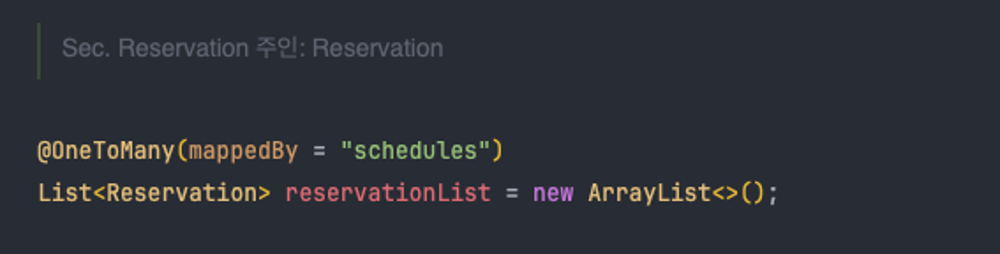
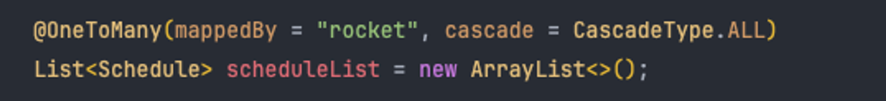

# ☻ 우주 여행

## ☺︎ 목표 구현 기능


---

### 이 기능을 구현하며 가장 많이 오류를 겪었던 것 : JPA

JPA 테이블 연관관계 매핑에서 가장 많은 에러가 발생했고, 많은 시간을 소요했다.

JPA 테이블 연관관계 매핑에서 1차로 에러를 겪었다. JPA를 제대로 공부하지 않았으면 사용하면 안 된다는 말을 실감했고.. 더 깊게 공부 해야겠다고 느꼈다.

거두절미하고, 이걸 바탕으로 JPA를 사용하기 위해 기본적으로 알아야 할 사항은 아래와 같다.

| 항목           | 설명                                                                                            |
|--------------|-----------------------------------------------------------------------------------------------|
| 양방향 연관관계     | JPA에서는 양방향 연관관계를 설정할 때 연관관계의 주인을 정해야 한다. 주인은 외래 키를 관리하며, 주인이 아닌 쪽은 단순히 연관관계를 조회하는 데만 사용된다.    |
| 다중성의 문제      | JPA에서는 @OneToOne, @OneToMany, @ManyToOne, @ManyToMany 등의 어노테이션을 사용하여 연관관계의 다중성을 정확하게 표현해야 한다. |
| 지연 로딩과 즉시 로딩 | JPA에서는 연관된 엔티티를 로딩하는 시점을 지연 로딩(Lazy Loading)과 즉시 로딩(Eager Loading)으로 설정할 수 있다.                |

JPA(Java Persistence API)는 SQL 쿼리를 직접 작성하지 않아도 데이터베이스 작업을 수행할 수 있게 해주어 편리해 보이지만, 내부 작동 방식과 원리를 이해하지 않고 사용하면 오히려 더 복잡해질 수
있다.

> 지금도 완벽히 JPA를 이해했다고는 못 하겠지만, 다만 JPA를 계속 공부할 것이기 때문에 잠깐 정리를 해보자면
>

---

### JPA를 사용한 이유

자바를 주 언어로 공부하고 있기에 자바 ORM인 JPA에 자연스레 관심이 생겼다.

나는 MyBatis를 배웠다. MyBatis는 SQL문을 직접 작성하며 SQL을 공부하고, 직접 쿼리를 컨트롤 할 수 있다는 장점이 있다.

반면 JPA는 이러한 작업들을 전체 다 해준다. SQL을 직접 작성하는 대신, 개발자는 데이터에 대한 작업을 Java 객체에 대한 작업으로 처리할 수 있다. CRUD 연산을 메소드만으로 처리하는 등 DB 작업
코드량을 줄이는 등 편리함을 제공한다.

다만, 공부하지 않고서 JPA를 사용하면 오히려 성능 저하를 야기할 수도 있고, 학습 시간이 오래걸린다는 점이 있다. 나는 JPA를 계속 공부할 것이기에 .. JPA를 선택했다!

---

# ☺︎ 테이블

우선 예약 기능을 구현할 때 **예약(Reservation), 사용자(User), 행성(Planet), 일정(Schedule)** 총 네 개의 테이블을 사용했다.

이 과정에서, 사용자 정보를 조회하는 데 필요한 이메일을 → 예약 테이블의 → User users 필드로 부터 얻어오는 방식 등 테이블 간의 **연관관계를 매핑 해줌**에 있어서 Null 값이 발생하는 등 많은
에러를 겪었다.

이런 기본적인 부분을 다시 공부하면서 개발을 했기에 예약 기능, 예약 조회 기능 구현에 시간을 많이 소요했고, 대략 3일이 걸렸다.

우선, 예약 기능에 필요한 테이블 ERD이다.


### 예약 기능 흐름


사용자가 예약을 생성하고, 예약이 출발 행성, 도착 행성, 일정을 포함하며, 일정이 로켓을 사용하는 과정은 위와 같다.

---

# ☺︎ Reservation ↔ Planet

### 1:N 관계

- `Schedule` 테이블에서 출발 행성(`departurePlanet`)과 도착 행성(`arrivalPlanet`)을 참조하고 있다.
- 각 스케쥴 데이터는 두 개의 행성을 참조하고 있으며, 행성의 입장에서는 하나의 스케쥴 데이터에 속한다.
- Reservation 테이블은 Planet 테이블의 주인이다.

| Reservation | Planet |
|-------------|--------|
|             |        |


### 여기서 주인이란?


예약(Reservation)과 행성(Planet)의 관계에서 "주인"은 예약(Reservation)이라고 하였다. 예약은 특정 행성(Planet)에 대한 정보를 참조하고 있으며, 이 **관계에서 예약이 외래 키를
관리**한다. 즉, **어떤 행성에 대한 예약이 생성되거나 변경될 때, 해당 예약 정보가 행성에 대한 참조를 업데이트하는 역할**을 한다.

### “JPA에서 주인이란 정확히 뭔가?”

내가 어려웠던 점은 FK를 갖고 있는 주인 테이블은 읽고, 쓰고, 삭제할 수 있다고 했다. 그러면 예약 테이블에서 행성 테이블의 정보를 마음대로 쓰고 삭제할 수 있다는 것인가? 아니 주인이 정확히 뭘 의미하는 건가?

### 내가 이해한 바로 JPA에서 주인이란

**연관관계를 관리하는 측**이다. 연관관계의 주인은 외래 키를 관리하는 측이며, 주인이 아닌 측은 단순히 연관관계를 조회하는데 사용된다.

즉,  **예약이 행성(Planet)에 대한 외래 키 (Foreign Key)를 관리**하고, Resrvation에서 Plnaet을 설정하거나 변경할 때 데이터 베이스의 외래키도 함께 변경되도록 하기 때문이다.

“주인”이라는 용어에 약간 오해가 있었다. 주인 역할을 하는 엔티티라고 해서 주인이 아닌 측의 엔티티를 마음대로 수정하거나 변경할 수 있는 것은 아니다. “주인”이라는 개념은 단지 JPA에서 연관관계를 관리하기 위한
것이며, 비즈니스 로직에 대한 권한을 의미하는 것은 아니다.


### JPA에서 중복 FK 적용하기

또 고려해야 했던 것은 Reservation은 Planet의 PK를 두 개 참조하고 있다. 다대일(@ManyToOne) 관계에서 외래 키를 여러 개 사용하려면 각 외래 키에 대해 별도의 @ManyToOne
어노테이션을 사용해야 한다.

처음엔 아래처럼 필드를 선언하였다.

```jsx
private
Planet
planet;
```

그리고 이렇게 PlanetId를 가져오면 된다고 생각했다.

```jsx
arrival = planet.getplanetId
departure = planet.getplanetId
```

### 아니다. JPA와 객체 지향을 생각해보면

여기서 `planet` 객체는 특정 행성을 나타내는 인스턴스이다. 예를 들어, `planet`이 '지구'를 나타내면, 이 `planet`은 항상 '지구'를 나타낸다. **따라서 '화성'을 나타내려면
새로운 `planet` 객체가 필요**했던 것이다.

### 해결책은

`planet` 필드를 두 개로 분리하여 각각 `departurePlanet`과 `arrivalPlanet`를 나타내야 했다. 각 `planet` 객체는 특정 행성을 나타내며, **출발 행성과 도착 행성은 전혀 다른
역할과 의미**를 가지므로 이들을 나타내는 `planet` 객체도 서로 독립적으로 관리해야 한다.

JPA는 객체 지향과 관계형 데이터베이스 사이의 패러다임 불일치 문제를 해결해주기 위한 거라고 알고 있는데, 나는 이걸 완전히 간과하고 있었다.

### JPA에서 하나 이상의 FK를 참조해야 한다면

하나의 엔티티에서 동일한 타입의 다른 엔티티를 두 개 이상 참조하려면 각 참조에 대해 별도의 필드를 설정해야 한다.

따라서 `private Planet planet;` 이라는 한 줄로 두 개의 외래 키를 설정하는 것은 불가능하다. 예를 들어, **Reservation 엔티티가 출발 행성과 도착 행성을 참조해야 하면 아래와 같이
각각 별도의 필드를 설정**해야 한다.

```jsx
private
Planet
departurePlanet;
private
Planet
arrivalPlanet;
```

### 그 이유는?

PA에서는 데이터베이스의 외래키(Foreign Key, FK)를 객체 지향적인 관점에서 '참조'라는 개념으로 다룬다.

예를 들어, 로켓 예약 시스템에서 '예약(Reservation)' 테이블이 '행성(Planet)' 테이블의 기본 키를 두 번 참조하고 있다고 생각해보자. 하나는 '출발 행성(Departure Planet)', 다른
하나는 '도착 행성(Arrival Planet)'을 가리키는 외래 키이다. 이 두 행성은 서로 다른 역할과 의미를 가지므로, 이 관계를 ORM으로 올바르게 표현하기 위해서는 두 개의 별개의 필드가 필요했다.

이러한 방식을 통해 데이터베이스의 관계를 객체 지향적으로 표현할 수 있다.

---

# ☺︎ Reservation↔ User

## **다대일(N:1) 관계**

| User                                                                                                             | Reservation                                                                                                      |
|------------------------------------------------------------------------------------------------------------------|------------------------------------------------------------------------------------------------------------------|
|  |  |

Reservation과 User 사이의 관계는 다대일(N:1) 관계이다. 한 명의 사용자(User)가 여러 개의 예약(Reservation)을 가질 수 있다.

Reservation 측에서는 @ManyToOne 어노테이션을 사용하여 User와의 관계를 설정한다.

```java

@ManyToOne
@JoinColumn(name = "user_id")
private User user;
```

User 측에서는 @OneToMany 어노테이션을 사용하여 Reservation과의 관계를 설정한다. 이 때 mappedBy 속성을 사용하여 **관계의 주인이 Reservation임을 명시**한다.

```java

@OneToMany(mappedBy = "user", cascade = CascadeType.ALL)
private List<Reservation> reservations = new ArrayList<>();
```

이렇게 설정하면 JPA는 User와 Reservation 사이의 다대일(N:1) 관계를 자동으로 관리한다.

사용자(User)가 예약(Reservation)을 추가하거나 제거할 때, 해당 예약의 소유자(User) 필드도 자동으로 업데이트 된다. 또한, Reservation을 조회하면 해당 예약의 소유자(User)도 함께
조회할 수 있다.

### 수정 전 User is null 에러와 그 원인

```jsx
@OneToMany(mappedBy = "user", cascade = CascadeType.ALL)
private
List < Reservation > reservationList;

@ManyToOne(fetch = FetchType.EAGER)
@JoinColumn(name = "user_id", referencedColumnName = "user_id")
public
User
user;
```

### 해결

```jsx
// 연관관계 set
public
void setUser(User
users
)
{
    this.users = users;
}
```

`User` 객체를 `Reservation` 객체에 설정하지 않았었다.

`setUser(User users)`는 `User` 타입의 매개변수를 받아 `Reservation` 객체의 `users` 필드에 할당한다.

그래야 `Reservation` 객체는 `User` 객체를 참조할 수 있게 된다. 이런 방식으로 객체 간의 관계를 설정하는 것을 "연관관계 설정"이라고 한다. 즉, Reservation 객체가 User를 참조할 수
없었기에 NPE가 계속 발생했었다.

단순히 `@OneToMany`나 `@ManyToMany` 어노테이션만 사용하는 것으로는 객체 간의 관계를 제대로 설정할 수 없다. JPA에서는 이런 어노테이션을 통해 객체 간의 관계를 선언하는 것과 별개로, 실제로
연관관계를 설정하는 것이 필요하다.


<details>
<summary>테스트 코드</summary>

```java

@DisplayName("예약Test")
@Test
@Transactional
public void testUserMakesReservation() {
    //유저 저장
    User user = User.builder().username("testuser").password("password").email("testuser@example.com").phoneNumber("1234567890").passportNumber("AB123456").birtDate(new Date()).locked(false).enabled(true).role("ROLE_USER").build();
    userRepository.save(user);

    //행성 저장
    Planet departurePlanet = new Planet(1L, "Departure Planet", "Departure Description");
    Planet arrivalPlanet = new Planet(2L, "Arrival Planet", "Arrival Description");
    planetRepository.save(departurePlanet);
    planetRepository.save(arrivalPlanet);

    //예약에 필요한 정보 추출
    Optional<Planet> dep = planetRepository.findById(departurePlanet.getPlanetId());
    Optional<Planet> arr = planetRepository.findById(arrivalPlanet.getPlanetId());
    String userEmail = user.getEmail();
    String userPhone = user.getPhoneNumber();
    String userPass = user.getPassportNumber();

    //예약 정보 생성
    Reservation res = new Reservation();
    res.setDeparturePlanet(dep.get());
    res.setArrivalPlanet(dep.get());
    res.setTravleDate(new Date());
    res.setPassengerCount(1);
    res.setPaymentStatus("Pending");
    res.setUser(user);

    reservationRepository.save(res);
}
```

</details>


테스트 코드에서는 사용자(User)에 대한 모든 파라미터를 직접 설정하고, setUser 메소드를 통해 User 객체를 Reservation 객체에 바로 연결할 수 있었다.

다만, 실제 코드에서는 User 호출이 제대로 이루어 지지 않았고, 애초에 User 엔티티를 불러올 수 없었기에 지연 로딩(Lazy) 또는 즉시 로딩(Eager) 시점 자체가 의미가 없었다.

---

### List<Reservation>의 컬렉션을 사용하고 초기화하는 이유?

한 명의 사용자가 여러 개의 예약을 가질 수 있기 때문이다. 또, 컬렉션을 초기화하는 이유는 **NullPointException**을 방지하기 위해서다.

사용자가 처음 생성될 때는 **아직 어떠한 예약도 가지고 있지 않으므로, reservations 필드는 null 상태**이다. 이 상태에서 예약을 추가하려고 하면 NullPointException이 발생하게 된다.
따라서 컬렉션을 미리 초기화함으로써, **사용자가 생성될 때부터 예약을 추가할 수 있는 상태**를 만들어 주는 것이다.

예를 들어, 사용자(User)와 예약(Reservation)의 관계에서, 한 사용자가 여러 예약을 가질 수 있다.

이 경우, 단일 사용자가 가진 모든 예약을 한번에 관리하고 접근하기 위해 컬렉션을 사용한다. **예약의 입장에서 하나의 예약은 단 하나의 사용자(User)에게만 속하므로, 사용자를 나타내는 필드는 단일 객체**일
것이다. 그러나 여러 예약이 동일한 사용자를 참조할 수 있으므로, **사용자(User)의 입장에서 보면 예약(Reservation)을 컬렉션으로 관리**해야 한다.

### 예약(Reservation)은 왜 컬렉션이 아니라 객체를 선언하는거?

예약(Reservation) 테이블에서 **User를 필드로 선언하는 이유는 예약이 특정 사용자에게 속하므로, 이 관계를 나타내기 위해서**다. 이 필드를 통해, **예약이 어떤 사용자에 의해 만들어졌는지**를 알
수 있다. 또한, 이 필드를 통해 데이터베이스에 저장되는 외래 키를 관리한다. 즉, User 필드는 예약과 사용자 사이의 관계를 매핑하고, 이 관계를 데이터베이스에 저장하기 위한 용도로 사용된다.

---

# ☺︎ Reservation ↔ Schedule

## (일대다)1:N 관계

Reservation과 Schedule은 1:N 관계이고, 여기서 Reservation 테이블에 schedule_id라는 외래키가 있으므로, Reservation이 주인이 된다.


| ERD | Reservation | Schedule |
| --- | --- | --- |
|  |  |  |

---

# ☺︎ Schedule ↔ Rocket

| ERD | Schedule | Rocket |
| --- | --- | --- |
|  |  |  |


Schedule 테이블에서 Rocket의 참조키를 관리하므로 Schedule이 주인이 된다.

### Schedule

`@ManyToOne` 어노테이션은 `Schedule`이 하나의 `Rocket`을 참조함을 나타내고, `@JoinColumn` 어노테이션은 `Rocket`을 참조하는 외래 키가 `rocket_id`라는 것을 나타낸다. 즉, `Schedule`이 관계의 주인이며, `Rocket`과 `Schedule` 사이의 연관관계가 매핑된다.

### Rocket


`@OneToMany` 어노테이션으로 `Rocket`이 여러 `Schedule`을 가질 수 있음을 나타낸다. 여기서 `mappedBy` 속성은 관계의 주인이 아니라는 것을 나타낸다.

---


